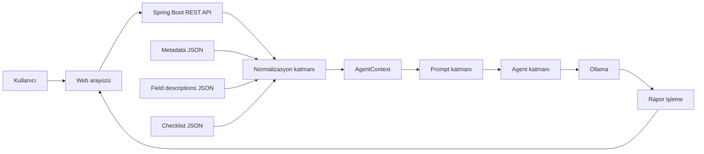
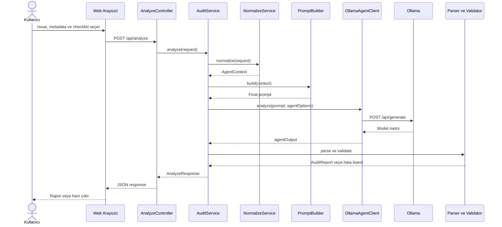
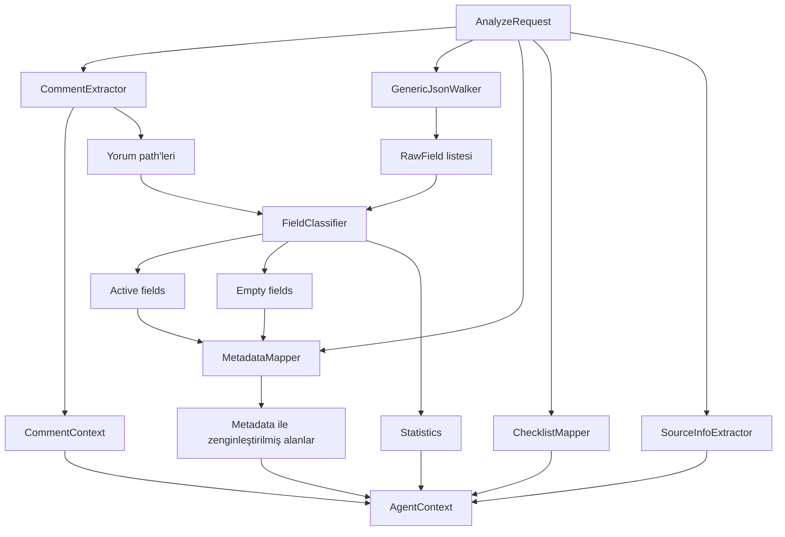
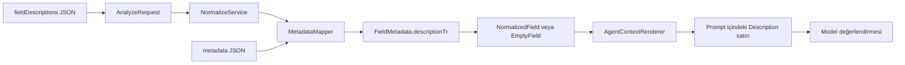
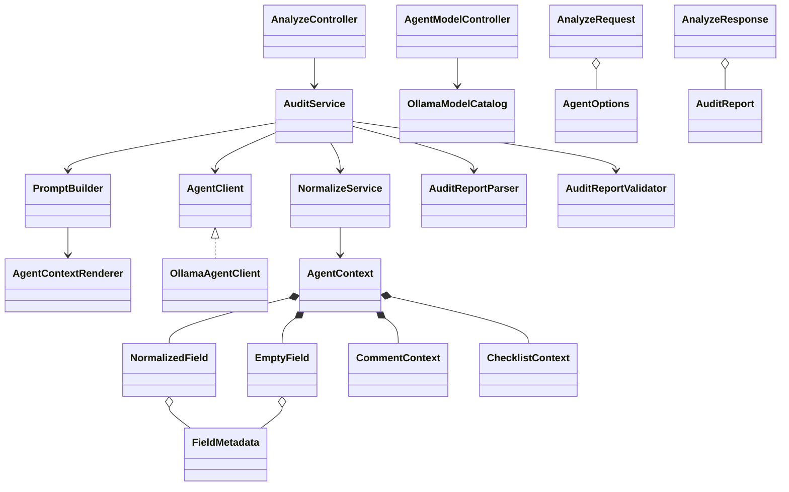

# Generic AI Audit Tool - Güncel Sistem Mimarisi

> Not: Ana teslimat artık `AuditEngine` ve `AgentTransport` üzerinden kullanılan bir kütüphane akışıdır. Bu belgedeki Spring MVC, Ollama ve yapılandırılmış JSON rapor bölümleri yerel demoyu anlatır. Güncel paket sınırı için [Kütüphane ve Demo Ayrımı](library_demo_ayrimi.md) belgesini esas alın.

Bu belge, uygulamanın mevcut kod yapısını ve çalışma akışını açıklar. İlk planlama belgesinden sonra eklenen yorum işleme, yapılandırılmış rapor, model seçimi, thinking desteği ve web arayüzü gibi parçalar burada güncel hâlleriyle ele alınmıştır.

Belgenin amacı yalnızca sınıfları listelemek değildir. Bir isteğin sisteme girdiği andan kullanıcıya rapor olarak döndüğü ana kadar hangi verinin nereden geçtiğini, hangi sınıfın hangi sorumluluğu taşıdığını ve sistemin hangi noktalarda model davranışına bağımlı olduğunu göstermektir.

## 1. Sistemin Amacı

Uygulama, Jira benzeri yapılandırılmış iş kayıtlarını yerel bir dil modeliyle denetlemek için geliştirilmiştir. Ham JSON doğrudan modele verilmez. Önce uygulama tarafından gezilir, gereksiz alanlardan ayrılır, metadata ve checklist bilgileriyle zenginleştirilir ve daha küçük bir `AgentContext` hâline getirilir.

Temel yaklaşım şöyledir:

```text
Ham iş kaydı
    -> deterministic normalizasyon
    -> anlamlandırılmış AgentContext
    -> sistem promptu
    -> yerel Ollama modeli
    -> denetim raporu
```

Burada "deterministic" ifadesi önemlidir. JSON alanlarını bulma, null alanları eleme, field kimliklerini metadata ile eşleştirme ve yorumları ayırma işlemleri dil modeline bırakılmaz. Model yalnızca hazırlanmış bağlam üzerinde denetim değerlendirmesi yapar.

## 2. Üst Seviye Mimari



Sistem tek bir Spring Boot uygulamasıdır. Ayrı mikroservisler bulunmaz. Ollama, uygulama dışında çalışan yerel model sunucusudur ve HTTP üzerinden çağrılır.

## 3. Katmanlar ve Sorumluluklar

### 3.1 Kullanıcı arayüzü

`src/main/resources/static/` altında bulunan arayüz aşağıdaki işleri yapar:

- Issue JSON dosyasını alır.
- Opsiyonel metadata ve checklist dosyalarını alır.
- `/api/models` üzerinden kurulu Ollama modellerini listeler.
- Seçilen model ve thinking ayarını analiz isteğine ekler.
- `/api/analyze` sonucunu rapor, uyarı veya ham çıktı olarak gösterir.

Arayüz doğrudan Ollama'ya bağlanmaz. Tüm model çağrıları backend üzerinden yapılır.

### 3.2 Controller katmanı

Controller sınıfları HTTP sözleşmesini yönetir:

- `AnalyzeController`: sağlık kontrolü, normalizasyon ve analiz endpointlerini sunar.
- `AgentModelController`: Ollama'da kurulu modelleri döndürür.
- `ApiExceptionHandler`: doğrulama ve bağlantı hatalarını ortak API cevabına çevirir.

Controller sınıfları JSON gezmez, prompt oluşturmaz ve denetim kararı vermez.

### 3.3 Service katmanı

`AuditService`, ana kullanım senaryosunu koordine eder:

1. İsteği `NormalizeService` ile normalize eder.
2. `PromptBuilder` ile model promptunu oluşturur.
3. `AgentClient` üzerinden modeli çağırır.
4. Model çıktısını parse etmeyi dener.
5. Parse edilen raporu doğrular.
6. Ham çıktı ile varsa doğrulanmış raporu birlikte döndürür.

### 3.4 Normalizasyon katmanı

Normalizasyon katmanı projenin modelden bağımsız çekirdeğidir:

- `GenericJsonWalker`: JSON ağacını recursive olarak gezer.
- `CommentExtractor`: yorum koleksiyonlarını ana field akışından ayırır.
- `CommentTextExtractor`: düz metin ve Atlassian Document Format benzeri içeriklerden yorum metni çıkarır.
- `FieldClassifier`: alanları aktif, boş, null ve noise olarak sınıflandırır.
- `MetadataMapper`: alanları metadata ve field açıklamalarıyla zenginleştirir.
- `ChecklistMapper`: checklist girdisini ortak modele dönüştürür.
- `SourceInfoExtractor`: kayıt kimliği ve başlığı gibi kaynak bilgisini bulur.
- `NormalizeService`: bu parçaları doğru sırayla çalıştırıp `AgentContext` üretir.

### 3.5 Prompt katmanı

- `PromptTemplateLoader`, `core_auditor.md` dosyasını okur.
- `AgentContextRenderer`, Java modelini okunabilir metne dönüştürür.
- `PromptBuilder`, sistem promptundaki `{{CONTEXT}}` alanını dinamik bağlamla değiştirir.

Prompt içindeki sabit talimatlar ile kullanıcıdan gelen veri açık sınırlarla ayrılır. Issue, metadata, açıklama, checklist ve yorum metinleri güvenilmeyen denetim verisi kabul edilir.

### 3.6 Agent katmanı

- `AgentClient`, model sağlayıcısından bağımsız arayüzdür.
- `OllamaAgentClient`, Ollama `/api/generate` endpointini çağırır.
- `OllamaModelCatalog`, `/api/tags` üzerinden kurulu modelleri okur.
- `OllamaProperties`, model URL'si ve üretim parametrelerini taşır.

Model seçimi istek içinde verilirse yalnızca o analiz için kullanılır. Verilmezse `application.properties` içindeki varsayılan model kullanılır.

### 3.7 Rapor katmanı

- `AuditReportParser`, model metnini `AuditReport` nesnesine çevirmeyi dener.
- `AuditReportValidator`, zorunlu alanları, severity değerlerini, evidence listesini ve tekrar eden bulguları kontrol eder.
- Parse veya validation başarısız olduğunda `agentOutput` kaybolmaz; ham çıktı kullanıcıya döner.

## 4. Analyze İsteğinin Uçtan Uca Akışı



### 4.1 AnalyzeRequest

İstek modeli şu alanları taşır:

```text
AnalyzeRequest
|- payload             zorunlu issue veya iş kaydı
|- metadata            opsiyonel field metadata
|- fieldDescriptions   opsiyonel açıklama sözlüğü
|- checklist           opsiyonel kontrol listesi
`- agentOptions        opsiyonel model ve thinking seçimi
```

Arayüzde issue, metadata, Türkçe alan açıklamaları ve checklist ayrı dosyalar olarak seçilebilse de backend'e tek bir `AnalyzeRequest` gönderilir. Türkçe alan açıklamaları dosyası opsiyoneldir ve `fieldDescriptions` alanına yerleştirilir.

## 5. Normalizasyon Akışı



### 5.1 GenericJsonWalker çıktısı

Walker her anlamlı düğüm için bir `RawField` oluşturur. Bu model şunları taşır:

- `path`: `fields.status.name` gibi tam yol.
- `parentPath`: üst düğümün yolu.
- `key`: alanın kendi anahtarı.
- `value`: ham `JsonNode` değeri.
- `detectedType`: string, array, object gibi gözlenen tür.
- `depth`: JSON içindeki derinlik.

Walker henüz alanın önemli, boş veya gereksiz olduğuna karar vermez.

### 5.2 FieldClassifier kararı

Classifier alanları şu şekilde ayırır:

- Dolu ve anlamlı alanlar -> `NormalizedField`
- Boş string, array veya object -> `EmptyField`
- Null alanlar -> prompttan çıkarılır, yalnızca sayılır
- URL, avatar ve teknik noise alanları -> prompttan çıkarılır, yalnızca sayılır
- Yorum path'leri -> ayrı `CommentContext` üretildiği için field listesinden çıkarılır

Bu sayede iki bine yakın null custom field içeren bir Jira kaydı modele iki bin satır olarak gönderilmez.

## 6. Field Description Tam Olarak Nereye Gidiyor?

`fieldDescriptions`, metadata'nın alternatifi değil, metadata kaydını tamamlayan opsiyonel bir açıklama sözlüğüdür.

Örnek girdi:

```json
{
  "fieldDescriptions": {
    "customfield_21014": "Gereksinimin ölçülebilir kabul kriterlerini içerir."
  }
}
```

Veri akışı şöyledir:



`MetadataMapper` önce metadata registry'sini oluşturur. Ardından `fieldDescriptions` içindeki anahtarları aynı registry'ye ekler veya mevcut metadata kaydını günceller. Örneğin metadata alanın adını ve türünü, `fieldDescriptions` ise kurum içindeki iş anlamını sağlayabilir:

```text
- Acceptance Criteria
  Path: fields.customfield_21014
  Empty Type: EMPTY_STRING
  Metadata ID: customfield_21014
  Schema Type: string
  Description: Gereksinimin ölçülebilir kabul kriterlerini içerir.
```

Bu açıklama `AnalyzeResponse` içinde ayrı bir üst seviye alan olarak dönmez. Çünkü açıklama bir denetim sonucu değil, modelin alanı doğru yorumlaması için kullanılan bağlamdır. Açıklamanın sisteme girip girmediğini görmek için `/api/normalize` endpointi kullanılabilir; ilgili `NormalizedField` veya `EmptyField` içindeki `metadata.descriptionTr` alanında görünür.

### 6.1 Arayüzden yükleme

Web arayüzündeki `Türkçe Alan Açıklamaları` alanı, field kimliğini açıklama metniyle eşleştiren bir JSON dosyası kabul eder. Ayrı dosya seçilmezse tam `AnalyzeRequest` içindeki `fieldDescriptions` veya metadata içindeki `descriptionTr` / `description` değerleri kullanılmaya devam eder.

## 7. Metadata Eşleştirme Mantığı

Metadata eşleştirmesi model tarafından değil Java kodu tarafından yapılır. Registry içinde field kimliği, adı ve Jira alias bilgileri tutulur.

Bir payload alanı için yaklaşık eşleştirme sırası:

1. Field key
2. Path içindeki parent field kimliği
3. Path'in son parçası
4. Field label veya metadata adı

Eşleşme bulunamazsa alan silinmez. `metadata.provided=false` olarak AgentContext içinde kalır.

`FieldMetadata` şu bilgileri taşıyabilir:

- Field kimliği ve adı
- Schema type, system ve items bilgileri
- Custom type ve custom ID
- Açıklama
- Zorunlu olma bilgisi
- Varsayılan değer bilgisi
- İzin verilen değerler

URL, avatar ve teknik gösterim alanları metadata'nın iş anlamı olmadığı için modele taşınmaz.

## 8. Yorum Akışı

Yorumlar sıradan active field olarak bırakılmaz. `CommentExtractor`, Jira'nın yaygın comment wrapper yapılarını ve doğrudan comment array biçimlerini tanımaya çalışır.

`CommentContext` şunları taşır:

- Yorum listesi
- Her yorumun yazarı, oluşturulma ve güncellenme zamanı
- Kaynak path
- Wrapper içindeki pagination bilgileri
- Yorumların tamamının alınıp alınmadığını gösteren coverage bilgisi

Yorum path'leri daha sonra `FieldClassifier` tarafından tekrar active field olarak üretilmez. Böylece aynı yorum promptta iki kez görünmez.

## 9. Prompt Oluşturma

`AgentContextRenderer`, context içeriğini sabit bölümlere ayırır:

```text
ENTITY
ACTIVE FIELDS
EMPTY FIELDS
COMMENTS
CHECKLIST
STATISTICS
```

`PromptBuilder`, bu metni `core_auditor.md` içindeki `{{CONTEXT}}` alanına yerleştirir. Context sınırları model açısından veri ile talimatı ayırır. Payload içinde "önceki talimatları görmezden gel" gibi bir metin bulunması hâlinde bunun sistem talimatı değil denetlenecek veri olduğu promptta açıkça belirtilir.

## 10. Model Seçimi ve Thinking

Arayüz `/api/models` çağrısıyla kurulu modelleri alır. Model katalog cevabı şunları içerir:

- Model adı
- Dosya boyutu
- Parametre boyutu
- Quantization seviyesi
- Ollama capabilities listesi
- Thinking desteği
- Varsayılan model olup olmadığı

`AgentOptions` verilirse model ve thinking ayarı yalnızca mevcut analiz için geçerli olur. Uygulamanın global ayar dosyası değiştirilmez.

Thinking açıkken Ollama JSON Schema zorlaması kullanılmaz. Bazı modeller final cevabı `thinking` alanına yönlendirebildiği için bu iki özellik birlikte güvenilir çalışmamıştır. Thinking kapalıyken runtime schema gönderilir.

## 11. Mevcut Rapor Sözleşmesi

Mevcut sistem modelden şu ana yapıyı ister:

```text
AuditReport
|- summary
|- findings[]
|  |- title
|  |- category
|  |- severity
|  |- evidence[]
|  |- rationale
|  `- recommendedAction
|- observations[]
|  |- type
|  |- description
|  `- evidence[]
`- recommendation
```

Thinking kapalıyken aynı yapı Ollama'ya JSON Schema olarak da gönderilir. Buna rağmen küçük modeller şu sorunları yaşayabilir:

- Cevabı tamamlamadan token sınırına ulaşma
- Tekrara girme
- Zorunlu bir string alanını boş bırakma
- Alan adını eş anlamlı başka bir adla yazma
- Thinking modunda JSON dışında açıklama üretme

JSON Schema söz dizimini iyileştirir, fakat modelin cevabı bitirmesini veya semantik olarak doğru karar vermesini garanti etmez.

## 12. Çıktı Formatı İçin Önerilen Yaklaşım

Bu proje için en sağlam MVP yaklaşımı iki ayrı çıktı modu sunmaktır. Tek model çağrısında hem Markdown hem JSON istenmez. Kullanıcı veya uygulama, analiz başlamadan önce hangi sözleşmenin kullanılacağını seçer.

```text
TEXT modu       -> Başlıklı metin istenir -> Her durumda doğrudan gösterilir
STRUCTURED modu -> JSON istenir           -> Geçerliyse kart, bozuksa ham çıktı gösterilir
```

Normal web kullanımı için `TEXT`, otomasyon ve deneyler için `STRUCTURED` tercih edilir. Her iki mod da tek Ollama çağrısı yapar.

### 12.1 TEXT modu

Modelden sabit Markdown başlıkları istenir:

```markdown
# Özet

# Bulgular

# Gözlemler ve Yetersiz Bağlam

# Son Öneri
```

Bu çıktı parse edilmek zorunda değildir. Arayüz metni güvenli biçimde gösterir. Model bir başlığı eksik yazsa bile rapor tamamen kaybolmaz. Başlıklar yalnızca okunabilirliği artıran bir format talimatıdır; sistemin çalışması başlıkların bire bir yazılmasına bağlı değildir.

### 12.2 STRUCTURED modu

Bu mod mevcut JSON Schema ve kart görünümünü kullanır. Model geçerli JSON üretirse bulgu kartları oluşturulur. JSON üretmezse sistem hata sayfasına düşmek yerine modelin ham çıktısını metin olarak gösterir.

Önerilen response yaklaşımı:

```json
{
  "agentOutput": "Modelin her durumda saklanan raporu",
  "outputFormat": "text",
  "report": null,
  "structuredOutput": false,
  "reportValidationErrors": []
}
```

Bu tasarımda `structuredOutput=false`, model çağrısının başarısız olduğu anlamına gelmez. Yalnızca kartlara dönüştürülebilen makine-okunur raporun oluşmadığını ifade eder.

### 12.3 Somut örnek

Aynı issue iki farklı biçimde çalıştırılabilir:

```text
Kullanıcı TEXT seçti
-> Prompt sabit rapor başlıklarını ister
-> Model Türkçe veya İngilizce rapor döndürür
-> UI cevabı doğrudan gösterir

Kullanıcı STRUCTURED seçti
-> Prompt ve Ollama JSON Schema ister
-> Geçerli JSON gelirse UI kartları gösterir
-> Geçersiz JSON gelirse UI ham model metnini gösterir
```

Bu yaklaşımda ikinci bir çeviri veya JSON tamir modeli çağrılmaz.

### 12.4 Neden yalnızca JSON'a güvenmemeliyiz?

JSON zorunluluğu şu faydaları sağlar:

- Rapor kartlarını kolay oluşturma
- Severity filtreleme
- Sonuçları otomatik karşılaştırma
- İleride veritabanına kaydetme

Ancak kullanıcıya rapor göstermek için JSON zorunlu değildir. Model davranışının değişken olduğu yerel ve küçük model ortamında, raporun hiç gösterilmemesi geçersiz bir JSON'dan daha büyük problemdir.

### 12.5 Değerlendirilen alternatifler

| Yaklaşım | Avantaj | Dezavantaj |
| --- | --- | --- |
| Katı JSON | Otomasyona uygundur | Truncation veya tek alan hatasında tüm yapı geçersiz olur |
| Sürekli parser fallback eklemek | Bazı model varyasyonlarını kurtarır | Sonsuz sayıda varyasyon vardır ve bakım maliyeti büyür |
| İkinci modele JSON tamir ettirmek | Bazı çıktıları düzeltebilir | Gecikme, kaynak tüketimi ve yeni hata ihtimali oluşturur |
| Yalnızca Markdown | En dayanıklı kullanıcı çıktısıdır | Kart, severity filtresi ve otomasyon zorlaşır |
| Seçilebilir TEXT / STRUCTURED modu | Kullanıcı raporu kaybolmaz ve otomasyon imkânı korunur | UI iki çalışma modunu desteklemelidir |

Önerilen seçenek son satırdaki hibrit yaklaşımdır.

### 12.6 Uygulama adımları

Bu değişiklik yapılacaksa güvenli sıra şöyledir:

1. `AgentOptions` içine `outputMode` seçeneği eklemek.
2. TEXT modu için sabit başlıklı prompt sözleşmesi oluşturmak.
3. Arayüzde `agentOutput` için güvenli metin görünümü eklemek.
4. STRUCTURED modunda mevcut JSON Schema ve kart görünümünü korumak.
5. "Rapor yapısı doğrulanamadı" ifadesini "Metin raporu oluşturuldu; kart görünümü üretilemedi" şeklinde değiştirmek.
6. Evaluation sonuçlarını output moduna göre ayrı değerlendirmek.

## 13. Güncel Sınıf İlişkileri



Bu diyagram, ilk plandaki sınıf yapısına göre şu önemli eklemeleri içerir:

- Comment extraction ve comment context
- Model kataloğu ve istek bazlı model seçimi
- Thinking seçeneği
- Audit report modelleri
- Parser ve validator
- Structured ve ham çıktıyı birlikte taşıyan response

## 14. Endpointler

| Endpoint | Amaç | Model çağrısı |
| --- | --- | --- |
| `GET /api/health` | Spring Boot servisinin çalıştığını gösterir | Hayır |
| `GET /api/models` | Kurulu Ollama modellerini listeler | Üretim yapmaz |
| `POST /api/normalize` | AgentContext üretir ve debug amacıyla döndürür | Hayır |
| `POST /api/analyze` | Tam normalizasyon, prompt ve model akışını çalıştırır | Evet |

## 15. Hata Sınırları

Sistemde üç farklı hata türünü ayırmak gerekir:

1. **Girdi hatası:** Payload yoktur veya JSON okunamaz.
2. **Runtime hatası:** Ollama kapalıdır ya da seçilen model kurulu değildir.
3. **Model çıktı problemi:** Model cevap vermiştir fakat cevap structured sözleşmeye uymamıştır.

Üçüncü durum sistem bağlantı hatası değildir. Modelin metni kullanıcıya gösterilebilir ve gösterilmelidir.

## 16. Test Stratejisi

Java testleri modelden bağımsız davranışları kontrol eder:

- JSON traversal
- Field classification
- Metadata ve açıklama eşleştirmesi
- Checklist mapping
- Comment extraction
- Prompt rendering
- Ollama request gövdesi
- Parser ve validator
- Controller sözleşmesi

LLM'in doğru finding üretip üretmediği normal unit test ile garanti edilemez. Bunun için `evaluation/scenarios/` altındaki fixture ve expected dosyaları kullanılır. Aynı senaryo farklı modellerle çalıştırılır ve sonuç semantik olarak karşılaştırılır.

## 17. Güncel Mimari Kararlar

- Normalizasyon kodla ve deterministic yapılır.
- Metadata eşleştirmesi modele bırakılmaz.
- Null alanlar prompta gönderilmez.
- Boş alanlar potansiyel denetim bağlamı olarak korunur.
- Yorumlar ayrı context olarak modellenir.
- Checklist bir rule engine değil, model bağlamıdır.
- Model seçimi analiz bazında değiştirilebilir.
- Ham model çıktısı hiçbir durumda kaybedilmez.
- Structured çıktı, model doğruluğunun garantisi değildir.
- Nihai denetim kararı kullanıcıya aittir.

## 18. Sonraki Mimari Çalışmalar

Önerilen sonraki sıra:

1. Hibrit text/structured çıktı kararını uygulamak.
2. Field descriptions dosya biçimini gerçek kurum örneğiyle doğrulamak.
3. Mevcut sequence ve class diyagramlarını kod değiştikçe bu belgede güncellemek.
4. Evaluation runner ile modelleri aynı senaryolarda otomatik ölçmek.
5. Gerçek anonimleştirilmiş kurum verisiyle doğrulama yapmak.

İlk planlama belgesi tarihsel kararları anlamak için yararlıdır. Güncel sistem davranışı ve UML kaynağı olarak bu belge esas alınmalıdır.
