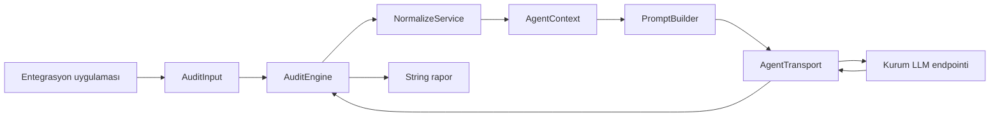
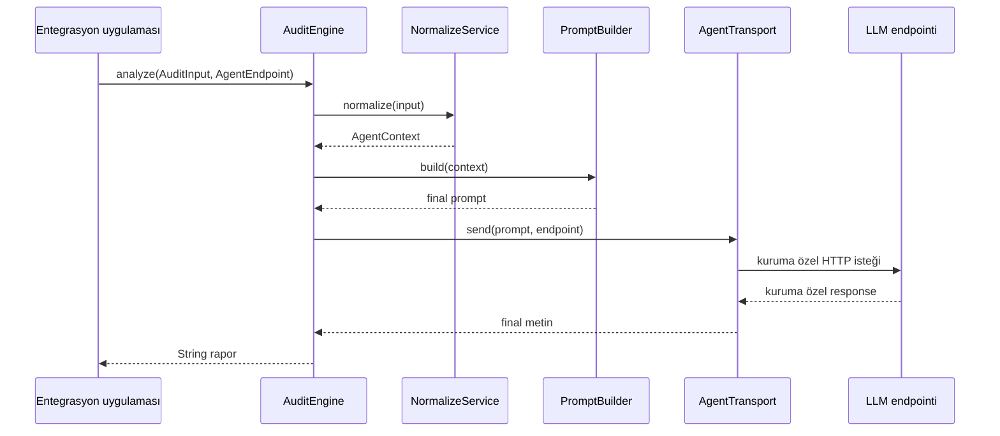
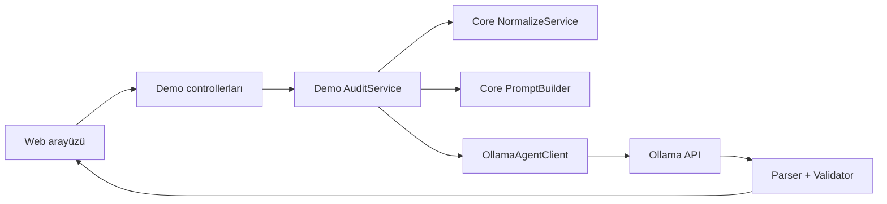

# Generic AI Audit Tool - Güncel Sistem Mimarisi

Bu belge, çalışan kodun mimari ana kaynağıdır. Sistemin merkezinde başka bir Java uygulamasının kullanabileceği `core` kütüphanesi bulunur. Spring Boot, Ollama, model seçimi ve web arayüzü yalnızca `demo` modülüne aittir.

Başka bir projeden kullanım için [Kütüphane Entegrasyon Rehberi](../integration/kutuphane_entegrasyonu.md), modül ayrımının gerekçesi için [Kütüphane ve Demo Ayrımı](library_demo_ayrimi.md) belgesini kullanın.

## İçindekiler

- [Amaç ve sınır](#amaç-ve-sınır)
- [Maven modülleri](#maven-modülleri)
- [Public API](#public-api)
- [Normalizasyon akışı](#normalizasyon-akışı)
- [Prompt üretimi](#prompt-üretimi)
- [Çıktı sözleşmeleri](#çıktı-sözleşmeleri)
- [Demo mimarisi](#demo-mimarisi)
- [Güvenlik ve hata sınırları](#güvenlik-ve-veri-sınırları)
- [Test stratejisi](#test-stratejisi)
- [Güncel mimari kararlar](#güncel-mimari-kararlar)

## Amaç ve Sınır

Sistem, Jira benzeri yapılandırılmış iş kayıtlarını kanıta dayalı bir denetim değerlendirmesi için hazırlar. Ham JSON doğrudan modele gönderilmez. Önce deterministic Java koduyla normalize edilir, metadata ve checklist ile anlamlandırılır, ardından modele açık sınırları olan bir audit context olarak verilir.

```text
Ham yapılandırılmış kayıt
        |
        v
Deterministic normalizasyon
        |
        v
Anlamlandırılmış AgentContext
        |
        v
Denetim promptu
        |
        v
Entegrasyonun sağladığı LLM transportu
        |
        v
Metin denetim raporu
```

Sistemin sorumluluğu şunlardır:

- JSON yapısını generic olarak gezmek.
- Aktif, boş, null ve gürültü alanlarını ayırmak.
- Custom field kimliklerini metadata ile eşleştirmek.
- Comment ve checklist bilgisini anlamını koruyarak prompta taşımak.
- LLM'e kanıta dayalı ve güvenli denetim talimatı vermek.

Sistemin sorumluluğu olmayan işler şunlardır:

- Jira API'sinden veri çekmek.
- Kurum LLM endpointinin mesaj sözleşmesini tahmin etmek.
- Model çıktısını kesin doğru veya bağlayıcı karar kabul etmek.
- DO-178C uygunluğu ya da sertifikasyon sonucu ilan etmek.

## Maven Modülleri

```text
root pom.xml
|- core/   audittool-core
`- demo/   audittool-demo -> audittool-core
```

| Modül | İçerik | Bağımlılık yönü |
| --- | --- | --- |
| `core` | Public API, normalizasyon, metadata, checklist, comment, prompt ve ortak modeller | `demo` paketlerini bilmez |
| `demo` | Spring Boot, Ollama adapterleri, web arayüzü, structured rapor parserı | `core` artifact'ine bağlıdır |

`core` Jackson ve bazı Spring altyapı sınıflarını kullanır; ancak Spring MVC, web arayüzü veya Ollama istemcisine bağlı değildir. Kurum uygulaması yalnızca `audittool-core` artifact'ini tüketebilir.

## Üst Seviye Mimari



Public giriş noktası [`AuditEngine`](../../core/src/main/java/com/yusuf/audittool/api/AuditEngine.java) sınıfıdır. Entegrasyon uygulaması bir [`AgentTransport`](../../core/src/main/java/com/yusuf/audittool/agent/AgentTransport.java) sağlar; core geriye kalan normalizasyon ve prompt bağımlılıklarını varsayılan constructor içinde kurar.

## Public API

### AuditInput

[`AuditInput`](../../core/src/main/java/com/yusuf/audittool/api/AuditInput.java) dört `JsonNode` taşır:

| Alan | Zorunluluk | Anlam |
| --- | --- | --- |
| `payload` | Zorunlu | Denetlenecek issue veya yapılandırılmış kayıt |
| `metadata` | Opsiyonel | Alan kimliği, adı, şeması, açıklaması ve allowed value bilgileri |
| `fieldDescriptions` | Opsiyonel | Field ID -> Türkçe/açıklayıcı metin eşleştirmesi |
| `checklist` | Opsiyonel | Denetim kriterleri veya kontrol listesi |

Bu alanlar dosya yolu değildir. JSON'un dosyadan veya HTTP'den okunması çağıran uygulamanın sorumluluğudur.

### AgentEndpoint

[`AgentEndpoint`](../../core/src/main/java/com/yusuf/audittool/api/AgentEndpoint.java), hedef URI ve header map'ini taşır. Yalnızca mutlak `http` ve `https` adreslerini kabul eder. Request body veya response alan adlarını tanımlamaz.

### AgentTransport

`AgentTransport` tek metotlu bir entegrasyon sınırıdır:

```java
String send(String prompt, AgentEndpoint endpoint);
```

Kurumun authentication, request body, timeout ve response parse etme kuralları bu implementasyonda kalır. Core'un kurum endpointine bağımlı olmamasını sağlayan ana abstraction budur.

### AuditEngine

`AuditEngine.analyze(input, endpoint)` şu üç işi yönetir:

1. `AuditInput` değerini `NormalizeService` ile `AgentContext` yapısına dönüştürür.
2. `PromptBuilder` ile denetim promptu üretir.
3. Promptu `AgentTransport` ile gönderir ve boş olmayan cevabı trim edilmiş `String` olarak döndürür.

Core, final model metnini JSON'a zorlamaz veya parse etmez.

## Uçtan Uca Core Akışı



## Normalizasyon Akışı

[`NormalizeService`](../../core/src/main/java/com/yusuf/audittool/normalize/NormalizeService.java), deterministic veri hazırlama adımlarını tek sırada birleştirir:

1. Payload yoksa isteği reddeder.
2. `CommentExtractor` ile comment kaynağını ve generic alan listesinden çıkarılacak path'i belirler.
3. `GenericJsonWalker` ile payload içindeki node'ları path bilgisiyle gezer.
4. `FieldClassifier` ile aktif, boş, null ve gürültü alanlarını ayırır.
5. `MetadataMapper` ile aktif ve boş alanları metadata ve field descriptions bilgisiyle zenginleştirir.
6. `SourceInfoExtractor` ile kayıt kimliği ve kısa etiketini çıkarır.
7. `ChecklistMapper` ile checklist yapısını ortak modele dönüştürür.
8. Sonuçları `AgentContext` içinde toplar.

```text
AuditInput
  |- payload -----------------> walker + classifier + comment extractor
  |- metadata ----------------> metadata registry
  |- fieldDescriptions -------> metadata description enrichment
  `- checklist ---------------> ChecklistContext
                                      |
                                      v
                                  AgentContext
```

### GenericJsonWalker

[`GenericJsonWalker`](../../core/src/main/java/com/yusuf/audittool/normalize/GenericJsonWalker.java), object ve array yapılarını recursive olarak gezer. Her node için şu bilgileri taşıyan bir `RawField` oluşturur:

- Tam path.
- Parent path.
- Key veya array index.
- Orijinal `JsonNode` değeri.
- Algılanan temel tip.
- Derinlik.

Walker iş anlamı çıkarmaya çalışmaz. Alanın boş, gürültü veya önemli olduğuna `FieldClassifier` karar verir.

### FieldClassifier

[`FieldClassifier`](../../core/src/main/java/com/yusuf/audittool/normalize/FieldClassifier.java) şu sınıflandırmayı yapar:

| Durum | Sonuç |
| --- | --- |
| `null` | Prompta eklenmez, istatistikte sayılır |
| `""` veya whitespace | `EMPTY_STRING` |
| `[]` | `EMPTY_ARRAY` |
| `{}` | `EMPTY_OBJECT` |
| Scalar değer | Aktif alan |
| `{name/value/key/displayName: ...}` gibi basit object | Tek anlamlı aktif değer olarak collapse edilir |
| Tek başına URL değeri | Gürültü olarak atlanır |
| `expand`, `operations`, `schema` key'leri | Gürültü olarak atlanır |

Object collapse sırasında `id`, `self`, `iconUrl`, `avatarId` ve `avatarUrls` gibi teknik ayrıntılar tekrar ayrı alan olarak eklenmez. Bilinmeyen diğer leaf alanlar generic walker akışında korunur; sabit key listesinde olmadığı için otomatik olarak kaybolmaz.

[`ChangeItemSummarizer`](../../core/src/main/java/com/yusuf/audittool/normalize/ChangeItemSummarizer.java), changelog item benzeri object'lerde field/from/to ilişkisini tek bir `change.compact` değerine dönüştürür. Bu davranış key adlarının küçük/büyük harf ve yaygın eş anlamlı varyasyonlarını destekler; belirli bir custom field ID'sine bağlı değildir.

### Metadata ve Alan Açıklamaları

[`MetadataMapper`](../../core/src/main/java/com/yusuf/audittool/metadata/MetadataMapper.java) farklı metadata şekillerinden ortak bir registry üretir. Desteklenen ana biçimler şunlardır:

- `values: [...]` içeren Jira field metadata cevabı.
- Doğrudan metadata array'i.
- `fields: { fieldId: {...} }` map'i.
- Project ve issue type içinde nested metadata.
- Tek field metadata object'i.

Field kimliği için `id`, `key`, `fieldId` ve map key'i; alias için metadata adı ve `clauseNames` kullanılır. Eşleştirme teknik key, path parçaları ve label adayları üzerinden yapılır.

Metadata'dan taşınan bilgiler:

- ID ve görünen ad.
- Schema type, system, items, custom type ve custom ID.
- Açıklama.
- `required` ve `hasDefaultValue`.
- Allowed value ID, label ve açıklamaları.

`fieldDescriptions` şu basit biçimde verilebilir:

```json
{
  "customfield_20105": "Değişikliğin teknik, takvimsel, mali ve güvenlik etkisi."
}
```

Bu açıklama eşleşen `FieldMetadata.descriptionTr` alanına yazılır. Aynı field için metadata adı ve şeması korunur; açıklama promptta `Description` satırı olarak görünür. Bir açıklama alanın ne anlama geldiğini söyler, ancak tek başına o alanın zorunlu olduğunu kanıtlamaz.

### Comment İşleme

[`CommentExtractor`](../../core/src/main/java/com/yusuf/audittool/normalize/CommentExtractor.java), yorumları normal field'lardan ayrı tutar. Kaynak adayları şu sırada aranır:

1. `fields.comment.comments`
2. `comment.comments`
3. `fields.comments`
4. `comments`

String body ve Jira Cloud benzeri rich-text body yapıları desteklenir. Kullanılabilir bilgiler `AuditComment` içinde body, author, created, updated, restricted visibility ve source path olarak tutulur.

Comment container generic field listesinden çıkarılır. Böylece body, author ve pagination değerleri hem comment hem normal alan olarak iki kez prompta girmez.

Coverage değerleri:

| Değer | Anlam |
| --- | --- |
| `FULL` | `startAt=0` ve total dönen comment sayısıyla uyumlu |
| `PARTIAL` | Sayfalama daha fazla comment olduğunu gösteriyor |
| `UNKNOWN` | Tamlık için yeterli veya tutarlı pagination bilgisi yok |

Comment tasarımının gerekçesi ve fallback ayrıntıları [Comment Context Tasarımı](comment_context_design.md) belgesindedir.

### Checklist İşleme

[`ChecklistMapper`](../../core/src/main/java/com/yusuf/audittool/checklist/ChecklistMapper.java) şu girdileri destekler:

- String checklist.
- String array.
- `text`, `title`, `name` veya `description` içeren object array.
- Bilinmeyen object biçimi için raw JSON bağlamı.

Checklist yokluğu otomatik bulgu değildir. Model, yalnızca kayıtla ilişkisi ve sağlanan kanıt yeterliyse checklist maddesini ihlal olarak raporlamalıdır.

## AgentContext

[`AgentContext`](../../core/src/main/java/com/yusuf/audittool/model/AgentContext.java), modelden bağımsız ortak iç modeldir:

```text
AgentContext
|- SourceInfo
|- activeFields: NormalizedField[]
|- emptyFields: EmptyField[]
|- CommentContext
|- ChecklistContext
`- ContextStatistics
```

`ContextStatistics`; aktif, boş, null, atlanan gürültü, metadata eşleşen ve metadata eşleşmeyen alan sayılarını tutar. Bu sayılar debug ve normalizasyon görünürlüğü içindir; tek başına audit bulgusu değildir.

## Prompt Üretimi

[`AgentContextRenderer`](../../core/src/main/java/com/yusuf/audittool/prompt/AgentContextRenderer.java), `AgentContext` değerini şu sabit bölümlere dönüştürür:

```text
ENTITY
ACTIVE FIELDS
EMPTY FIELDS
COMMENTS
CHECKLIST
```

Aktif ve boş alanlarda metadata eşleşmişse görünen ad, ID, schema, required bilgisi, açıklama ve allowed values birlikte render edilir. Evidence alanları orijinal dilini korur.

[`PromptBuilder`](../../core/src/main/java/com/yusuf/audittool/prompt/PromptBuilder.java) üç kaynağı birleştirir:

| Kaynak | Rol |
| --- | --- |
| `core_auditor.md` | Ortak audit rolü, kanıt kuralları, belirsizlik ve güvenlik sınırları |
| `output_markdown.md` | Core kütüphane için okunabilir başlıklı metin sözleşmesi |
| Render edilmiş `AgentContext` | Denetlenecek güvenilmeyen veri |

`AuditEngine`, Markdown çıktı profilini açıkça seçer. Spring tarafından oluşturulan demo `PromptBuilder` ise varsayılan `output_json.md` profilini kullanır. Böylece ortak audit mantığı tek dosyada kalırken çıktı sözleşmesi kullanım alanına göre ayrılır.

Dinamik veri `BEGIN_AUDIT_CONTEXT` ve `END_AUDIT_CONTEXT` sınırları içine yerleştirilir. Payload veya comment içinde bulunan “ignore previous instructions” benzeri metinler komut değil, denetlenecek veri kabul edilir.

## Çıktı Sözleşmeleri

### Core Kütüphane

Core varsayılan olarak şu Markdown başlıklarını ister:

```markdown
## Özet
## Bulgular
## Gözlemler ve Yetersiz Bağlam
## Önerilen Aksiyonlar
```

Model bir başlığı farklı yazsa bile `AuditEngine` cevabı kaybetmez; boş olmadığı sürece final metni çağırana döndürür. Bu, küçük modellerin ufak JSON veya schema hataları yüzünden tüm raporun kullanılamaz hale gelmesini önler.

### Yerel Demo

Demo web akışı `output_json.md`, Ollama JSON Schema, `AuditReportParser` ve `AuditReportValidator` kullanır. Geçerli yapı üretildiğinde rapor kartları gösterilir; ham model çıktısı ayrıca korunur.

Bu structured sözleşme demo özelliğidir. Kurum entegrasyonu ister Markdown metni doğrudan kullanabilir, ister kendi response sözleşmesini ayrıca uygulayabilir.

## Demo Mimarisi



Demo modülündeki iki Ollama adapterinin amaçları farklıdır:

| Sınıf | Amaç |
| --- | --- |
| `OllamaAgentClient` | Web demosunun structured JSON rapor ve model seçimi akışı |
| `OllamaAgentTransport` | Core `AuditEngine` akışını gerçek Ollama HTTP endpointiyle smoke test etmek |

Demo endpointleri:

| Endpoint | Amaç | Model çağrısı |
| --- | --- | --- |
| `GET /demo/api/health` | Uygulama sağlık kontrolü | Hayır |
| `GET /demo/api/models` | Kurulu modelleri listeler | Hayır |
| `POST /demo/api/normalize` | `AgentContext` sonucunu gösterir | Hayır |
| `POST /demo/api/analyze` | Structured demo analizini çalıştırır | Evet |

Demo kullanımı ve önerilen senaryolar için [Demo Akışı](../evaluation/demo_walkthrough.md) belgesine bakın.

## Güvenlik ve Veri Sınırları

- Payload, metadata, açıklama, checklist ve comment içeriği güvenilmeyen veridir.
- Dinamik context içindeki talimat benzeri metinler uygulanmaz.
- URL, avatar ve benzeri teknik gürültüler mümkün olduğunca prompttan çıkarılır.
- Core endpoint tokenlarını üretmez veya saklamaz; header'ları çağırandan alır.
- Prompt ve hassas payload içerikleri uygulama loglarına yazılmamalıdır.
- Comment içindeki linkler takip edilmez; model yalnızca verilen metni görür.
- Model reasoning/chain-of-thought içeriği kullanıcıya rapor olarak sunulmaz.

## Hata Sınırları

| Katman | Hata örneği | Sorumlu taraf |
| --- | --- | --- |
| Girdi | Payload yok veya JSON parse edilemedi | Entegrasyon uygulaması / `NormalizeService` |
| Endpoint | Göreli veya HTTP dışı URI | `AgentEndpoint` |
| Transport | Timeout, TLS, authentication veya HTTP hata kodu | Kuruma özel `AgentTransport` |
| Model | Boş response | `AuditEngine` tarafından reddedilir |
| Model biçimi | Başlık veya JSON sözleşmesine uymama | Core metni döndürür; demo parser sonucu ayrıca işaretler |
| Model anlamı | Yanlış finding veya false positive | Evaluation ve insan denetimi |

## Test Stratejisi

Core unit testleri şu deterministic davranışları kapsar:

- Recursive JSON traversal.
- Null, empty, active ve noise sınıflandırması.
- Metadata ve field description eşleştirmesi.
- Checklist fallbackleri.
- Comment body ve coverage extraction.
- Context rendering ve prompt profili.
- Public `AuditEngine` sözleşmesi.

Demo testleri şunları kapsar:

- Ollama request body ve response okuma.
- Model kataloğu ve thinking ayarı.
- Structured rapor parse/validation.
- Controller ve web request sözleşmesi.
- Mock HTTP üzerinden `AuditEngine -> AgentTransport` akışı.

Gerçek model davranışı unit test kabul edilmez. Senaryo fixture'ları ve model karşılaştırmaları [Değerlendirme Belgeleri](../evaluation/README.md) altında yönetilir. Gerçek Ollama smoke testi yalnızca `RUN_OLLAMA_INTEGRATION=true` ile açılır.

## Güncel Mimari Kararlar

- Ana teslimat `core` kütüphanesidir; demo ayrı modüldür.
- Dış sistemler `AuditEngine` üzerinden tek çağrı yapar.
- JSON dosya yolu değil, parse edilmiş `JsonNode` olarak verilir.
- Kurum mesaj sözleşmesi `AgentTransport` arkasında kalır.
- Normalizasyon deterministic Java koduyla yapılır.
- Null alanlar prompta gönderilmez; boş alanlar türüyle korunur.
- Metadata eşleştirmesi modele bırakılmaz.
- Field description, metadata açıklamasını zenginleştirir; zorunluluk kanıtı değildir.
- Comment'ler ilişki ve zaman bilgisini koruyan ayrı context'tir.
- Core model cevabını ham metin olarak döndürür.
- Structured JSON rapor, yerel demonun opsiyonel görünümüdür.
- Model sonucu karar desteğidir; nihai karar kullanıcıya aittir.

## Değişiklik Etkisi Rehberi

| Değişiklik | Öncelikle etkilenen yer |
| --- | --- |
| Yeni girdi alanı | `AuditInput`, `NormalizeService`, entegrasyon rehberi |
| Yeni metadata biçimi | `MetadataMapper` ve metadata testleri |
| Yeni comment biçimi | `CommentExtractor`, `CommentTextExtractor`, comment tasarım belgesi |
| Yeni prompt kuralı | `core_auditor.md`, prompt testleri, evaluation senaryoları |
| Yeni çıktı biçimi | Ayrı output profile ve ilgili tüketici |
| Kurum endpoint sözleşmesi | Yalnızca yeni `AgentTransport` implementasyonu ve testleri |
| Demo UI değişikliği | `demo` static/web paketleri; core API etkilenmez |

## İlgili Belgeler

- [Dokümantasyon Merkezi](../README.md)
- [Kütüphane Entegrasyon Rehberi](../integration/kutuphane_entegrasyonu.md)
- [Kütüphane ve Demo Ayrımı](library_demo_ayrimi.md)
- [Comment Context Tasarımı](comment_context_design.md)
- [Değerlendirme Stratejisi](../evaluation/evaluation_strategy.md)
- [Diyagram Kaynakları](../diagrams/README.md)
